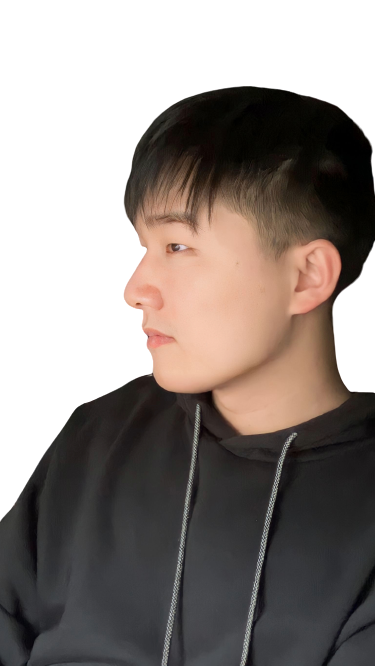

#build

## create a Portfolio directory
mkdir Portfolio
create  README.md index.html and a foloder called styles, with styles.scss, 
install extension "Live Sass Compiler","html css support " and "Live Server" in VS Code
when finished run sass --watch styles:css

then create a folder called img and put all the images in it.

open google fonts and choose a font and copy the link and paste it in the head of the html file. then copy the font-family to styles.scss

go to https://www.colorspire.com/ to select a color scheme and copy the colors to styles.scss

go to https://cdnjs.com/libraries/font-awesome to select font awesome icons and copy the link and paste it in the head of the html file. then copy the icons to styles.scss
<link rel="stylesheet" href="https://cdnjs.cloudflare.com/ajax/libs/font-awesome/6.4.2/css/all.min.css" integrity="sha512-z3gLpd7yknf1YoNbCzqRKc4qyor8gaKU1qmn+CShxbuBusANI9QpRohGBreCFkKxLhei6S9CQXFEbbKuqLg0DA==" crossorigin="anonymous" referrerpolicy="no-referrer" />
go to fontawesome.com and copy the icons you want and paste them in the html file
**Rember to watch sass and run live server when you modify**

###  why use scss? 
scss can nest the css, so it is more clear to read and write.


## create a app.js
be careful with ; and , and "" and '' and ``!!!
```
            e.target.classList.add('active') 
/* I add ; here so it doesn't work
```

#### Mistake: use wrong 

it should be allSections = document.querySelector, but I use allSections = document.querySelectorAll, that spend nearly half hour to find out.

```
const allSections = document.querySelector('.main-content');
const sections = document.querySelectorAll('.section');
```

### Pagetransitions
```
function PageTransitions(){
    // Iterating through each button (control) element in the sectBtn NodeList.
    for(let i = 0; i < sectBtn.length; i++){
        
        // Adding a click event listener to each button (control) element.
        sectBtn[i].addEventListener('click', function() {
            
            // Retrieving all elements with the class 'active-btn' 
            // and storing them in the currentBtn variable.
            let currentBtn = document.querySelectorAll('.active-btn');
            
            // Removing the 'active-btn' class from the first element in the currentBtn NodeList.
            // Using [0] to access the first element because querySelectorAll returns a NodeList.
            currentBtn[0].className = currentBtn[0].className.replace(' active-btn', '');
            
            // Adding the 'active-btn' class to the clicked button.
            // 'this' refers to the button element that was clicked and triggered the event listener.
            // Ensuring a space before 'active-btn' to avoid concatenating class names.
            this.className += ' active-btn';
        })
    }
```

#### Generate clip path
https://bennettfeely.com/clippy/, open this, and copy path to styles.

#### Mistake: add wrong ;

I add wrong ; behind scaleY(1)
```
    @keyframes sclaleAnim{
        0%{
            transform: translateY(-100%) scaleY(0)
        }
        100%{
            transform: translateY(-100%) scaleY(1)
        }
    }
```

#### Mistake: wrong active setting
@keyframes part not put in .active

```
.active {
    display: block;
    animation: appear 1s ease-in-out;
    transform: translateY(0) scaleY(1);
  }
  @keyframes appear {
    0% {
      transform: translateY(-100%) scaleY(0);
    }
    100% {
      transform: translateY(0) scaleY(1);
    }
  }
```

#### Mistake :forget to add pointer-events: none; to .control

I forget to add pointer-events: none; to .control
```
        i{
            font-size: 1.5rem;
            color: var(--color-gray-1);
            pointer-events: none;
            
        }
```
#### Mistake: Put the div part outside the section
the h-shapre and image part should nest inside the left-header div , it spend me a lot of time to find out.
```
            <div class="left-header"></div>
                <div class="h-shape"></div>
                <div class="image">
                    
                </div>
```
### Mistake:

I use wrong hover scale, translateY(-4px) is right, but I use (-4rem), it's huge.
```
            &:hover{
                transform: translateY(-4px);
``` 

